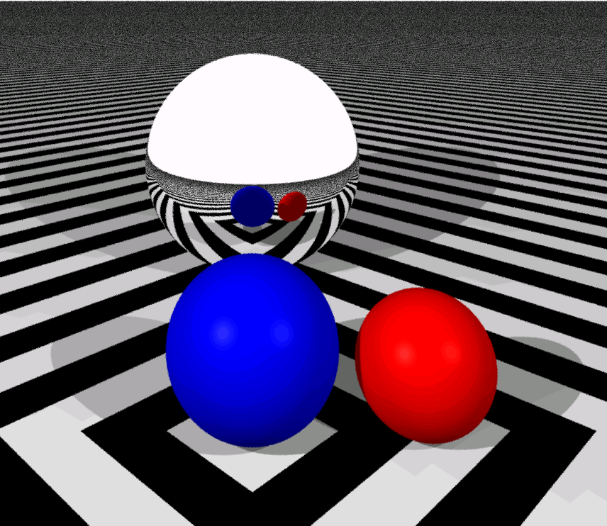

# Simple path tracer implementation for educational purposes

Simple raytracer is an simple and efficient CPU distributed raytracing / path-tracing implementation from scratch in C++ that mainly serves educational purposes. It has no other dependencies than QT for displaying the resulting image and its design is held simple by design.


# Installation

Simply install QT and open the project by the simple_raytracer.pro project file. 

# Features

## Primitives with hit function

All supported primitives are children of the abstract `mesh` class and posess a `hit` method. Supported are:

- Triangles
- Spheres
- Checkerbord floor

Triangle meshes can be read from an .obj file using the `mesh::read_obj` method. Files containing normals and textures are supported, but textures usage is not supported yet.

## Acceleration data structures

The raytracer supports two types of KD-Tree as acceleration data structures, which can be found in the __data_structures.cpp__. Both trees split at the median of the centroids and contain no duplicates.

- `basic_kd_tree` is a basic static KD-Tree saving a bounding-box for each node and supporting a fast [Ray-AABB](https://www.scratchapixel.com/lessons/3d-basic-rendering/minimal-ray-tracer-rendering-simple-shapes/ray-box-intersection) intersection check 
- `fast_kd_tree` is an advanced KD-Tree saving only the t-value in split dimension instead of bounding-boxes. This allows acceleration by early-stopping checks for each ray. Additionally, the advanced kd-tree is traversed from front to back for a given light ray, resulting in further acceleration.

## Parameters and multithreading

Most ray-tracing parameters are public members of the `view` class or are arguments of the class contructor. Multithreading is also available by setting the `num_threads` to a value superior to 1.

```
    //DOF options
    float focal_dist = -1; //Use -1 to turn off DOF
    float aperture = 0.01;

    //distributed raytracing options
    int samples_per_ray = 1;
    bool anti_alias = false;

    //path tracing options
    bool path_tracing = false;
    float lighting_fac = 100;
    float roulette_prob = 1;
    bool next_event = false;
    bool cos_weighted = false;

    //multithreading options
    int num_threads = 15;
    bool shadows = true;

    //general raytracing options
    int max_recursion_depth = 5;
    
    //contructor arguments / required arguments
    view(int width, int height, vec3f viewer_pos, vec3f viewing_dir, mesh &msh, float viewing_dst, std::vector<vec3f> light_srcs, std::vector<float> light_intensites);

```

## Local Illumination and Shading models

Available local illumination and shading models include the following features:

- [Lambertian reflection](https://en.wikipedia.org/wiki/Lambertian_reflectance)
- [Phong reflection](https://en.wikipedia.org/wiki/Phong_reflection_model)
- Flat shading
- Ambient illumination
- Color interpolation / [Gouraud shading](https://en.wikipedia.org/wiki/Gouraud_shading)
- Normal interpolation / [Phong shading](https://en.wikipedia.org/wiki/Phong_reflection_model)

## Reflection and Refraction

Reflection is supported for all primitives by setting `surface.specular = true`. Refraction is TBD.


## Distributed Raytracing features
### Antialiasing
Antialiasing can be used by setting `view.antialias = true` and `view.samples_per_ray > 1`. It is implemented by shooting multiple randomly-jittered rays per pixel and averaging the resulting color-values. This corresponds to a stratified-subsampling with a box-filter.

| Regular subsampling     | Stratified subsampling |
:-------------------------:|:-------------------------:
|




### Other features

Other supported distributed-raytracing features are:

- Soft shadows
- Glossy reflections
- Depth of field (DOF) effect

{width=80%}

## Path Tracing features

Basic path-tracing by monte-carlo integration over light rays is available as well as a number of additions for faster convergence. Available features include:

- Cosine-weighted importance sampling
- Reflectance importance sampling
- Next-Event Estimation 
- Russian Roulette


| Regular + RR           | Next Event + RR | Cos. Importance + RR | Cos. Importance + NE + RR|
:-------------------------:|:-------------------------:|:-------------------------|:-------------------------:
| || 

